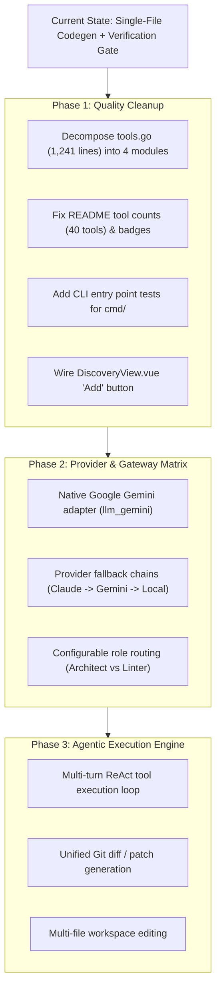

# Nexus Orchestrator — Comprehensive Project Audit & Gap Analysis

**Date:** 2026-09-25  
**Audit Scope:** Entire codebase (`backend Go`, `frontend Vue`, `vscode-extension`, `docs`, `CI`)  
**Target Standard:** 100% Definition of Done (DoD) & Universal Agentic Orchestration Readiness

---

## 1. Executive Summary & Strategic Fit

> [!WARNING]
> **Can Nexus Orchestrator currently serve as the main universal orchestrator for all agentic workflows?**
>
> **Partially, with substantial architectural gaps:**
>
> 1. **Current Nature:** Nexus is a robust local daemon providing SQLite persistence, per-project session isolation, a 40-tool MCP server, a BM25/FTS5 project brain, and a single-file prompt-and-write execution engine with deterministic test/compiler verification gates (added in PLAN-071).
> 2. **Agentic Loop Gap:** Nexus is **not** an autonomous multi-step ReAct agent. It cannot dynamically invoke tools (bash, file search, symbol lookup) across multiple turns, nor can it inspect multiple files and apply unified diffs.
> 3. **Provider Gap:** While Anthropic Claude, OpenAI, Ollama, and LM Studio are supported, **Google Gemini is not natively supported** (no Google GenAI SDK adapter), and **GitHub Copilot is only detected as an external caller, NOT an executable backend model**.

---

## 2. Gap Matrix vs Definition of Done

| Requirement                | DoD Target                      | Actual State                                           | Status              |
| :------------------------- | :------------------------------ | :----------------------------------------------------- | :------------------ |
| **Backend Test Coverage**  | 100%                            | ~68% avg (`cmd/` & `bootstrap` at 0.0%)                | 🔴 Significant Gap  |
| **Frontend Test Coverage** | 100%                            | 22.87% statements (`HistoryView` at 0%)                | 🔴 Critical Gap     |
| **VS Code Ext Coverage**   | 100%                            | 60.6% statements                                       | 🟡 Moderate Gap     |
| **Mutation Testing**       | 100%                            | 0% (no mutation testing configured)                    | 🔴 Missing          |
| **Stubs & Placeholders**   | 0                               | 3 items (Tray, Discovery TODO, Docs screenshot)        | 🟡 Needs Cleanup    |
| **Documentation Sync**     | 100%                            | README claims 14 tools (actual: 40); version tag stale | 🟡 Fast Fix         |
| **Cloud Providers**        | Claude, Gemini, Copilot, OpenAI | Claude ✅, OpenAI ✅, Gemini ❌, Copilot ❌            | 🔴 Architecture Gap |
| **Agentic Loop**           | Multi-turn autonomous tool use  | Single-file overwrite + verify gate only               | 🔴 Architecture Gap |
| **Type & Lint Issues**     | 0                               | 0 warnings (`golangci-lint`, `go vet`, `vue-tsc`)      | 🟢 Clean            |

---

## 3. Test Coverage Audit

### Backend Go Packages (`go test -cover ./...`)

| Package                                        | Statement Coverage | Status / Untested Areas                                  |
| :--------------------------------------------- | :----------------- | :------------------------------------------------------- |
| `cmd/nexus-cli`                                | **0.0%**           | CLI entry point, flag parsing, subcommands               |
| `cmd/nexus-daemon`                             | **0.0%**           | Daemon bootstrapping, signal handling, graceful shutdown |
| `cmd/nexus-mcp-stdio`                          | **0.0%**           | Stdio proxy JSON-RPC pipe                                |
| `cmd/nexus-submit`                             | **0.0%**           | Submit CLI tool flags (`--verify`, `--turns`)            |
| `internal/bootstrap`                           | **0.0%**           | Provider factory and daemon initialization wiring        |
| `nexus-orchestrator` (root `app.go`)           | **7.8%**           | Desktop Wails bindings and event hooks                   |
| `internal/core/domain`                         | **29.4%**          | Value object helpers and domain error constructors       |
| `internal/adapters/inbound/httpapi`            | **56.1%**          | Provider edge cases, session query filters               |
| `internal/adapters/outbound/llm_ollama`        | **58.6%**          | Error decoders, stream chunking                          |
| `internal/adapters/outbound/repo_sqlite`       | **59.7%**          | Specific query branches and migration error paths        |
| `internal/adapters/outbound/sys_scanner`       | **66.5%**          | Cross-platform registry/process inspection branches      |
| `internal/adapters/inbound/cli`                | **68.5%**          | CLI output formatting error branches                     |
| `internal/core/services`                       | **69.9%**          | Watchdog edge cases, stale cleanup recovery paths        |
| `internal/adapters/outbound/httpapi_client`    | **76.2%**          | 100% method coverage; specific error branches open       |
| `internal/adapters/inbound/mcp`                | **76.7%**          | Schema edge cases, unknown tool rejection paths          |
| `internal/adapters/outbound/llm_anthropic`     | **76.8%**          | API error decoding and token count headers               |
| `internal/adapters/outbound/llm_openaicompat`  | **78.1%**          | Provider-specific baseURL normalization edge cases       |
| `internal/adapters/outbound/activity_continue` | **76.9%**          | Session parsing error branches                           |
| `internal/adapters/outbound/activity_claude`   | **81.5%**          | Claude JSONL parsing edge cases                          |
| `internal/adapters/inbound/tray`               | **84.6%**          | Stub behavior covered                                    |
| `internal/adapters/outbound/fs_writer`         | **87.9%**          | Path traversal security and writeback                    |
| `internal/adapters/outbound/cmd_runner`        | **93.1%**          | Command execution and timeout handling                   |
| `internal/adapters/outbound/activity_network`  | **94.6%**          | Port sweep and probe logic                               |

### Frontend & Extension Coverage

- **Frontend (`frontend/src/`)**: **22.87% Statements**, **14.58% Branches**.
  - `HistoryView.vue`: **0%**
  - `BrainView.vue`: **0%**
  - `DiscoveryView.vue`: **0%**
  - `DashboardView.vue`: **0%**
  - Only `BacklogView.vue` (70%), `SettingsView.vue`, `ProvidersView.vue`, `AgentsView.vue`, and composables have unit tests.
- **VS Code Extension (`vscode-extension/`)**: **60.6% Statements**, **44.8% Branches**.
  - `statusBar.ts`: 60.3%
  - `taskQueueProvider.ts`: 60.9%
  - `commands/submitTask.ts`: 60.7%

---

## 4. Stubs, Placeholders & Unlinked Features

1. **System Tray Adapter (`internal/adapters/inbound/tray/tray.go`)**:
   - `Enabled()` unconditionally returns `false`.
   - `Start()` only logs a message stating the tray is disabled.
   - `UpdateStatus()` formats a tooltip string and discards it (`_ = fmt.Sprintf(...)`).
   - _Root Cause_: Systray requires the OS main thread on macOS/Windows, which is already claimed by Wails.
2. **Discovered Provider Linkage (`frontend/src/views/DiscoveryView.vue:44`)**:
   - Contains `// TODO: navigate to providers view and open add form pre-filled`.
   - Clicking "Add" on a discovered local runtime fails to navigate or pre-fill the form.
3. **Docs Placeholder (`docs/getting-started.html:338`)**:
   - Contains raw placeholder markup: `
Dashboard screenshot placeholder
`.

---

## 5. Outdated Documentation & Code Comments

1. **[README.md](README.md)**:
   - Line 4 badge indicates `v0.9.1` (extension is `v0.9.4`, CHANGELOG has `v0.10.0`).
   - Line 46 states "MCP JSON-RPC 2.0 server on :63988 (14 tools...)"; actual tool count is **40 tools**.
2. **In-Code Comments**:
   - `tray.go:50`: `// TODO(#XXX): implement system tray — requires main-thread dispatch on macOS/Windows`
   - `tray.go:64`: `// TODO(tray): use the formatted string to update systray tooltip once wired.`

---

## 6. Boss Files (> 500 Lines)

Files exceeding clean maintainability boundaries that should be factored into domain modules:

| File                                                      | Lines     | Primary Responsibility | Issue                                                       |
| :-------------------------------------------------------- | :-------- | :--------------------- | :---------------------------------------------------------- |
| `internal/adapters/inbound/mcp/tools.go`                  | **1,241** | All 40 MCP tools       | God-file handling schema definition, parsing, and execution |
| `internal/adapters/outbound/httpapi_client/client.go`     | **847**   | HTTP client            | 30 disparate endpoint methods in a single file              |
| `vscode-extension/src/nexusClient.ts`                     | **637**   | Extension HTTP client  | Massive monolithic TypeScript API client                    |
| `frontend/src/views/AgentsView.vue`                       | **616**   | Agent session manager  | Complex UI handling tables, details, modals, and SSE        |
| `internal/core/services/orchestrator.go`                  | **580**   | Core orchestration     | Central god-service holding queue, worker, state            |
| `frontend/src/views/ProvidersView.vue`                    | **571**   | Provider control panel | Combined configuration, catalog, and discovery UI           |
| `internal/adapters/outbound/repo_sqlite/repo.go`          | **562**   | Task SQLite repository | Giant raw SQL query catalog                                 |
| `internal/adapters/outbound/sys_scanner/plan_scanner.go`  | **539**   | Plan file discovery    | Markdown parsing and heuristic extraction                   |
| `internal/adapters/outbound/sys_scanner/agent_scanner.go` | **508**   | System process scanner | Multi-platform port sweeps and regex sniffing               |

---

## 7. E2E Testing Gaps

1. **No Automated Desktop GUI E2E**:
   - No headless Wails test runner exists to verify that desktop IPC bindings match frontend expectations.
2. **Playwright Suite Idle**:
   - Playwright configuration and specs exist under `frontend/`, but they are not executed during CI or `make test`.
3. **No VS Code Host Integration Suite**:
   - The extension has 31 Vitest unit tests, but zero `@vscode/test-electron` integration tests validating real command execution and quick-pick flows inside a live VS Code window.

---

## 8. Strategic Roadmap to Reach Universal Orchestrator Status

### Action Plan

1. **Phase 1: Architecture Cleanup & Documentation Sync**
   - Split `internal/adapters/inbound/mcp/tools.go` into `tools_tasks.go`, `tools_brain.go`, `tools_providers.go`, and `tools_sessions.go`.
   - Update `README.md` to reflect `v0.10.0` and the complete 40-tool MCP catalog.
   - Wire `DiscoveryView.vue` to navigate to `ProvidersView` with prefilled provider fields.
   - Add unit tests for `cmd/nexus-cli`, `cmd/nexus-daemon`, and `internal/bootstrap`.

2. **Phase 2: Cloud Provider Expansion & Smart Routing**
   - Add native `llm_gemini` outbound adapter using the official Google GenAI Go SDK.
   - Implement deterministic fallback chains (`Frontier Cloud` $\to$ `Fallback Cloud` $\to$ `Local Ollama`).
   - Add task role hints to `domain.Task` to route architecture/design tasks to frontier models and boilerplate/linting tasks to fast local models.

3. **Phase 3: Multi-File Agentic Execution Loop**
   - Upgrade `execution_engine.go` from a single-file overwrite mechanism to an interactive agent loop that can read files, inspect diagnostics, execute shell commands, and apply patch diffs before running verification gates.
