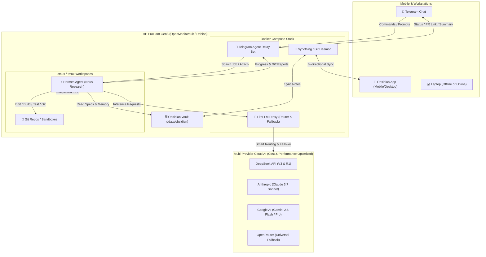

# Strategic Assessment: Nexus Orchestrator & Autonomous AI Workflow Blueprint

---

## Executive Summary & Honest Assessment of Nexus Orchestrator

### 1. The Core Question: Does `nexus-orchestrator` Still Make Sense?

**Short Answer: As a general AI code generator / task queue, no. As a custom personal infrastructure piece, only with a major architectural pivot.**

To be completely honest and transparent: **The AI landscape has undergone a seismic shift between 2023/2024 and today.**

#### What Nexus Orchestrator Built (And Built Well)

Nexus Orchestrator is an impressive piece of software engineering:

- **Clean Architecture:** Strict hexagonal design (ports & adapters) in Go.
- **Robust Persistence:** SQLite with WAL mode, additive schema migrations, and concurrency safety.
- **Rich Interfaces:** Multi-endpoint HTTP API, SSE streaming, full JSON-RPC 2.0 MCP server, VS Code extension, and Wails desktop GUI.
- **Provider Discovery:** Automatic runtime scanning and multi-provider abstraction (Ollama, LM Studio, Anthropic, OpenAI).

#### Where the AI Agent Paradigm Left It Behind

The fundamental assumption behind Nexus Orchestrator's core execution loop (`execution_engine.go`) is:
$$\text{Task Prompt} + \text{Context Files} \longrightarrow \text{LLM Call} \longrightarrow \text{Regex/File Write to TargetFile}$$

In today's agent ecosystem, this **single-shot prompt-and-write model is obsolete** for real-world software engineering because:

1. **Autonomous Tool-Use Loops (ReAct / Plan-and-Solve):** Modern coding agents (Claude Code, Aider, Hermes Agent, Cursor, Cline/Roo Code, Antigravity) do not just output code blocks to a single file. They run dynamic multi-turn loops: discovering files via grep/glob, inspecting syntax trees, running linters, executing test suites (`go test`, `pytest`, `npm test`), catching stack traces, and iteratively fixing errors before finalizing a git commit.
2. **Standardized Gateways vs. Custom Routing:** Dedicated open-source routing proxies like **LiteLLM Proxy** and platforms like **OpenRouter** have completely solved provider failover, dynamic load balancing, model aliases, cost tracking, token budgeting, prompt caching, and rate-limit retries at the proxy layer.
3. **MCP Shifted to Direct Tools:** Instead of an orchestrator acting as an MCP server with a rigid task queue (`submit_task`, `claim_task`), agents themselves act as MCP _clients_ that dynamically connect to bash, git, browser, database, and knowledge tools.

---

## What Should Happen to Nexus Orchestrator?

| Option                                                | Recommendation         | Pros & Cons                                                                                                                                                                                                                         |
| ----------------------------------------------------- | ---------------------- | ----------------------------------------------------------------------------------------------------------------------------------------------------------------------------------------------------------------------------------- |
| **Option A: Archive / Portfolio Showcase**            | ⭐ **Recommended**     | **Pros:** Saves dozens of hours of maintenance. The codebase is a pristine example of Go hexagonal architecture, MCP server implementation, and Wails UI.<br>**Cons:** You stop building on your custom engine.                     |
| **Option B: Pivot to Headless Agent Runner / Relay**  | Feasible if desired    | **Pros:** Reuse your Go daemon as the bridge between your Telegram bot and external CLI agents (Hermes/Aider).<br>**Cons:** High maintenance when mature tools (e.g. OpenHands, LiteLLM, Telegram bot daemons) exist off-the-shelf. |
| **Option C: Rebuild into full Autonomous Agent Loop** | ❌ **Not Recommended** | **Pros:** Complete control.<br>**Cons:** Massive effort reinventing tool execution, diff patchers, tree-sitter AST, token window management, and subagent orchestration.                                                            |

---

## The Ultimate Headless Remote Workflow: cmux + Obsidian + Hermes + Telegram + HP ProLiant Gen8 (OMV)

Here is the exact architectural blueprint to build an autonomous, 24/7 self-hosted AI engineering setup where your laptop does not need to stay on.



---

### 1. Hardware & OMV Feasibility Check: HP ProLiant MicroServer Gen8

- **Hardware Profile:** Ivy Bridge CPU (Celeron G1610T or Xeon E3-1265L v2), DDR3 ECC RAM, no modern GPU, SATA drive bays.
- **Local Model Inference Reality:** The Gen8 CPU is **NOT** capable of running 70B models or fast 8B/14B coding models at usable speeds (no modern AVX2/AVX-512, no CUDA GPU).
- **As an Always-On 24/7 Agent Orchestrator & Relay:** **It is 10/10 PERFECT.**
  - Low power consumption (~25W–45W idle).
  - Handles Docker, Git daemons, Syncthing, Telegram bot services, LiteLLM proxy, and multiple parallel headless agent CLI sessions with barely 5% CPU usage.

---

### 2. Component Synergy: How cmux, Obsidian, and Hermes Work Together

#### A. Obsidian: The Central Brain & Project Repository

- Store all your project specifications, roadmaps, architectural rules (`AGENTS.md`), memory logs, and task backlogs in an Obsidian Vault (`/data/vault`).
- **Syncing:** Run **Syncthing** as a Docker container on OMV to continuously sync your Obsidian vault between your Mac/PC, iPhone/Android, and the Gen8 server in real time.
- **Agent Integration:** Hermes reads directly from `vault/Projects/<ProjectName>/specs.md` and writes execution summaries to `vault/Projects/<ProjectName>/agent-log.md`.

#### B. Hermes (Agent Execution Engine)

- **Hermes Agent** (from Nous Research / OpenHermes ecosystem) is designed for agentic tool use, function calling, and terminal execution.
- Configured with workspace access to your git repositories, bash tools, and Obsidian markdown files.
- Operates in a ReAct loop: _Read file $\to$ Plan changes $\to$ Apply patch $\to$ Run tests $\to$ Verify $\to$ Git commit $\to$ Notify_.

#### C. cmux / tmux: Session Persistence & Terminal Multiplexing

- Run agent processes inside persistent terminal multiplexer sessions (`cmux` or `tmux`) on the Gen8 server.
- **Benefits:**
  - If your network drops or your laptop goes to sleep, the agent continues running in the background.
  - You can SSH in from anywhere (or inspect via web terminal like `ttyd` or VS Code Remote Server) to attach to the live agent session.
  - Run multiple agents on different projects concurrently in separate pane/window sessions.

---

### 3. The 24/7 Telegram Coding Workflow

Imagine this real-world flow while you are away from your desk:

1. **You send a Telegram message:**
   ```text
   /code nexus-dashboard "Fix the SSE connection retry logic in frontend and add unit tests. Check specs in Obsidian."
   ```
2. **Telegram Bot on OMV:**
   - Acknowledges: _"🚀 Task started for `nexus-dashboard` in cmux session #4."_
   - Checks out a new git branch: `agent/fix-sse-retry`.
   - Spawns Hermes Agent inside the project repository.
3. **Hermes Agent Execution:**
   - Reads context and project rules from Obsidian / local files.
   - Requests code edits via LiteLLM Proxy.
   - Executes tests (`npm test` / `go test`) inside the container sandbox.
   - Fixes failing tests automatically.
   - Commits changes to the branch and pushes to GitHub/GitLab.
4. **Telegram Bot delivers the result:**
   ```text
   ✅ Task completed in 2m 14s!
   • Files changed: 3 (frontend/src/sse.ts, frontend/test/sse.test.ts)
   • Tests: 12 passed, 0 failed
   • Branch: agent/fix-sse-retry
   • Cost: $0.038 (LiteLLM: DeepSeek-V3 + Claude 3.7 Sonnet)
   [View GitHub PR] | [Approve Merge]
   ```

---

## Multi-Provider Model Strategy: Maximize Quality, Minimize Cost, Eliminate Rate Limits

To run agent workflows without hitting rate limits or spending hundreds of dollars, deploy **LiteLLM Proxy** on your Gen8.

### 1. The Multi-Tier Model Stack

| Tier                                       | Best Models                                         | Primary Use Cases                                                        | Approx. Cost (Input / Output per 1M tokens)                               |
| ------------------------------------------ | --------------------------------------------------- | ------------------------------------------------------------------------ | ------------------------------------------------------------------------- |
| **Tier 1: High-Volume Workhorse**          | **DeepSeek-V3**<br>**Gemini 2.5 Flash**             | Fast edits, file search, repo mapping, test generation, simple bug fixes | **DeepSeek-V3:** ~$0.14 / $0.28<br>**Gemini 2.5 Flash:** ~$0.075 / $0.30  |
| **Tier 2: Deep Reasoning & Complex Logic** | **DeepSeek-R1**<br>**Claude 3.7 Sonnet (Thinking)** | Architecture planning, complex debugging, refactoring, code verification | **DeepSeek-R1:** ~$0.55 / $2.19<br>**Claude 3.7 Sonnet:** ~$3.00 / $15.00 |
| **Tier 3: Massive Context Ingestion**      | **Gemini 2.5 Pro**                                  | Reading entire codebases at once (up to 2M token context window)         | ~$1.25 / $5.00                                                            |

### 2. How to Eliminate Rate Limits and Optimize Costs

1. **LiteLLM Router with Automatic Fallback:**
   Configure a virtual model alias `smart-coder` in LiteLLM:
   - Primary: **DeepSeek-V3** (Fast & 90% cheaper).
   - If rate-limited (HTTP 429) $\to$ Fallback to **Gemini 2.5 Flash**.
   - If complex reasoning required $\to$ Escalate to **Claude 3.7 Sonnet** or **DeepSeek-R1**.
   - If direct provider down $\to$ Fallback to **OpenRouter**.
2. **Prompt Caching:**
   - Both Anthropic and DeepSeek support prompt caching. LiteLLM preserves cached prefixes, slashing repetitive codebase context costs by **75% to 90%**.
3. **Multiple API Keys / Load Balancing:**
   - LiteLLM allows adding multiple API keys for the same provider (e.g. 2 Anthropic keys, 2 DeepSeek keys) and distributes requests round-robin to double your RPM/TPM throughput.
4. **Token Budget & Cooldown Rules:**
   - Set cooldowns (e.g. 60 seconds on 429) so background jobs queue cleanly rather than crashing.

---

## Step-by-Step Implementation Roadmap for OMV

### Phase 1: Deploy Core Services on OMV (Docker Compose)

Create `/docker/ai-stack/docker-compose.yml`:

- **LiteLLM Proxy:** Exposes OpenAI-compatible port `:4000` with unified model aliases and fallback routes.
- **Syncthing:** Synchronizes `/data/obsidian` across your devices.
- **Telegram Bot / Relay Daemon:** Listens for commands and interacts with `cmux`/`tmux`.

### Phase 2: Configure LiteLLM Configuration (`config.yaml`)

Define model groups (`fast-coder`, `deep-reasoning`, `full-repo-analysis`) with automatic retries and multi-key fallbacks.

### Phase 3: Setup Hermes Agent & Sandbox Workspace

Install Hermes CLI inside a dedicated container or host environment with access to git, compilers/interpreters, and your project workspaces.

### Phase 4: Connect Telegram Bot to cmux Sessions

Link your Telegram bot to execute commands inside isolated `cmux` or `tmux` sessions, capturing output logs and sending status updates.

---

## Summary Checklist & Next Decisions

- [x] **Nexus Orchestrator Decision:** Archive as a solid architectural reference or pivot to a headless wrapper; do not spend time building a custom LLM prompt-runner.
- [x] **Hardware Feasibility:** HP ProLiant Gen8 + OMV is ideal as a 24/7 headless orchestrator and Docker host, relying on cloud APIs for inference.
- [x] **Ecosystem Integration:** Obsidian (Knowledge) + Hermes (Agent) + cmux (Multiplexer) + Telegram (Remote Control).
- [x] **Cost & Limits:** LiteLLM Proxy with DeepSeek-V3/R1, Gemini 2.5 Flash, and Claude 3.7 Sonnet for sub-$5/month high-performance coding.
